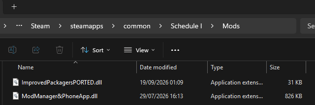
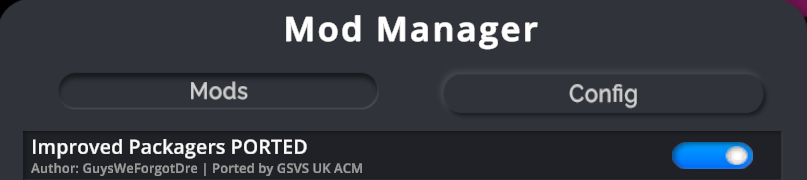
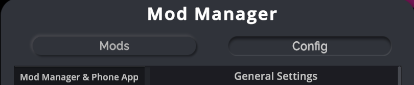
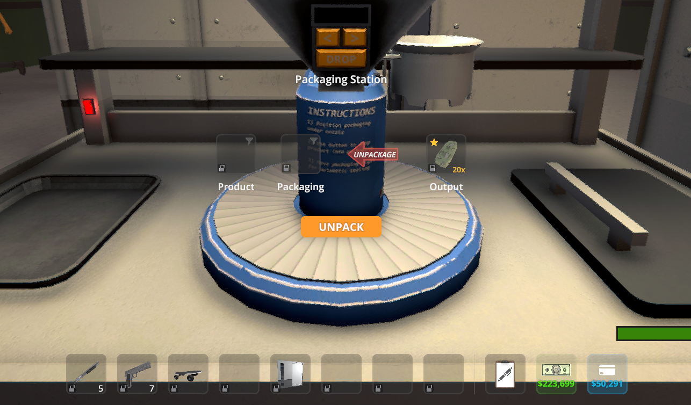
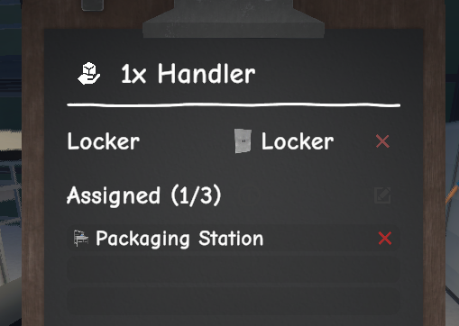
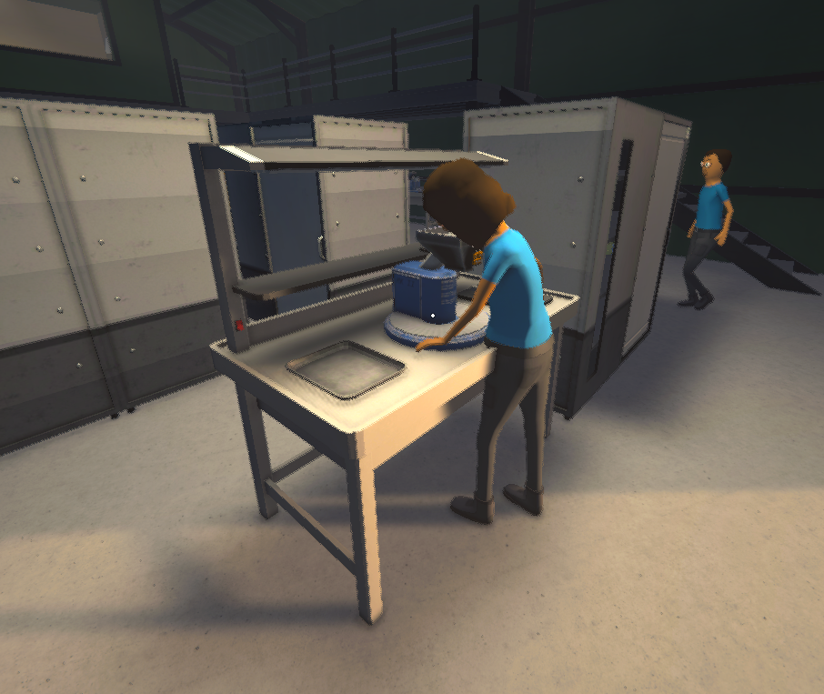

# Improved Packagers PORTED

Improved Packagers PORTED brings the original Improved Packagers mod to current Schedule I IL2CPP builds. It lets Packagers follow each Packaging Station's pack or unpack mode and use routes to load vehicles parked in Loading Bays.

## ⬇️ Download Improved Packagers PORTED

[](https://github.com/xboxnuker-rgb/improved-packagers-ported/releases/download/v2.0.1-f13-ported/Improved-Packagers-PORTED-v2.0.1-Schedule-I-f13.zip)
[](https://www.nexusmods.com/schedule1/mods/2604)
[](https://www.patreon.com/cw/GSVS_UK_ACM/shop)

### [⬇️ DOWNLOAD IMPROVED PACKAGERS PORTED](https://github.com/xboxnuker-rgb/improved-packagers-ported/releases/download/v2.0.1-f13-ported/Improved-Packagers-PORTED-v2.0.1-Schedule-I-f13.zip)

Download `Improved-Packagers-PORTED-v2.0.1-Schedule-I-f13.zip`. **Do not download GitHub's autogenerated `Source code` archives; they are not the installable mod.**

Also available on [Nexus Mods](https://www.nexusmods.com/schedule1/mods/2604), with the same tested DLL, installation guide, requirements and original-author credit.

- **Requires:** [MelonLoader](https://melonwiki.xyz/#/)
- **Requires:** [Mod Manager & Phone App](https://www.nexusmods.com/schedule1/mods/397)
- **Current release:** 2.0.1 for Schedule I 0.4.6f13 IL2CPP ([GitHub](https://github.com/xboxnuker-rgb/improved-packagers-ported/releases/tag/v2.0.1-f13-ported) · [Nexus Mods](https://www.nexusmods.com/schedule1/mods/2604)).

## Compatibility

| Schedule I branch | Backend | Status |
| --- | --- | --- |
| Main/default 0.4.6f13 | IL2CPP | Version 2.0.1 passed isolated and Harder Working Employees-enabled unpack/delivery testing. |
| Alternate | Mono | Legacy source/project retained; not verified by the 2.0.1 compatibility port. |

IL2CPP and Mono builds are not interchangeable.

## Installation

1. Close Schedule I.
2. Remove every original or older Improved Packagers DLL from `%ScheduleOne Install%/Mods/`, including `ImprovedPackagers.dll`, `ImprovedPackagersPORTED.dll`, and `Main-ImprovedPackagers.dll`.
3. Install the required [Mod Manager & Phone App](https://www.nexusmods.com/schedule1/mods/397) if it is not already installed.
4. Extract `ImprovedPackagersPORTED.dll` from the downloaded ZIP into the `Mods` directory.
5. Start the game, open Mod Manager, and make sure **Improved Packagers PORTED** is enabled.

| Put both required DLLs in `Schedule I/Mods` | Confirm the PORTED mod is enabled |
| --- | --- |
|  |  |

The required Mod Manager & Phone App provides the in-game **Mod Manager** and **Config** screens:



Only one Improved Packagers/Improved Packagers PORTED DLL should be installed at a time. **Do not run the original and PORTED versions together.**

Configuration is stored in:

- Loading Bay preferences: `UserData/MelonPreferences.cfg`
- Packaging Station modes: `UserData/ImprovedPackagers.json`

Opening or toggling an existing Packaging Station records an explicit mode. If no saved mode exists, the worker can infer it when f13 reports exactly one work mode as ready.

## See it working

| Select Unpackage mode | Assign a handler |
| --- | --- |
|  |  |



## Features

### Unpackage

- Packagers obey the pack/unpack setting of assigned Packaging Stations.
- They can unpack baggies, jars, or bricks.
- An empty or matching product must be available in the input slot, as with manual unpacking.

### Load vehicles

- Packagers can use routes from storage and equipment to vehicles in Loading Bays.
- The IL2CPP build supports Load Only, Unload Only, and Dual direction per dock.
- Item filters, stack sizes, and normal route mechanics still apply.
- Two Packagers using Dual mode can move items in a loop; configure routes deliberately.

## Building the IL2CPP version

Use references generated by the exact Schedule I version being targeted. Do not commit them.

The reference root must contain:

```text
MelonLoader/
  net6/
    MelonLoader.dll
    0Harmony.dll
    Il2CppInterop.*.dll
    Mono.Cecil.dll
  Il2CppAssemblies/
    Assembly-CSharp.dll
    Il2Cppmscorlib.dll
    Il2CppFishNet.Runtime.dll
    UnityEngine*.dll
```

With PowerShell and a .NET SDK installed:

```powershell
.\scripts\verify-game-api.ps1 -MelonLoaderRoot "<path-to-MelonLoader>"
.\scripts\build-il2cpp.ps1 -MelonLoaderRoot "<path-to-MelonLoader>"
```

The build output is `bin/Il2Cpp/ImprovedPackagersPORTED.dll`. The legacy `ImprovedPackagers.csproj` remains available for the older Mono workflow; the current IL2CPP build uses `ImprovedPackagers.Il2Cpp.csproj` and targets `net6.0`.

## Troubleshooting

- `Undefined target method` means the DLL was built for a different game version. Use a release that names the installed Schedule I version.
- A first-run missing-file error for `ImprovedPackagers.json` indicates an older mod build is still installed.
- If the game loads both Improved Packagers and Improved Packagers PORTED, remove both DLLs and reinstall only `ImprovedPackagersPORTED.dll`.
- The `PackagerConfiguration::.ctor` IL2CPP backend fallback is not patched by this mod. Reproduce it with an isolated mod set before attributing it to Improved Packagers.

## Contributing

See [CONTRIBUTING.md](CONTRIBUTING.md), [AGENTS.md](AGENTS.md), and the [current handover](docs/HANDOVER.md).

## Source and contact

- License: [MIT](LICENSE.txt)
- Maintained port: [xboxnuker-rgb/improved-packagers-ported](https://github.com/xboxnuker-rgb/improved-packagers-ported)
- Original upstream: [GuysWeForgotDre/Improved-Packagers](https://github.com/GuysWeForgotDre/Improved-Packagers)
- Original author: `GuysWeForgotDre`
- Ported and maintained by: `GSVS UK ACM`
- Formerly called *Packagers Load Vehicles*
- Discord: `OnlyMurdersSometimes`
- GitHub: `GuysWeForgotDre`

Enjoy the port? [Visit the GSVS UK ACM Patreon shop](https://www.patreon.com/cw/GSVS_UK_ACM/shop) to support continued compatibility work. The original mod and author remain credited above.
